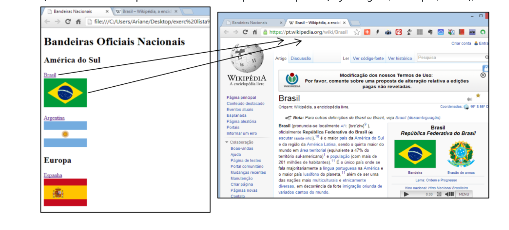
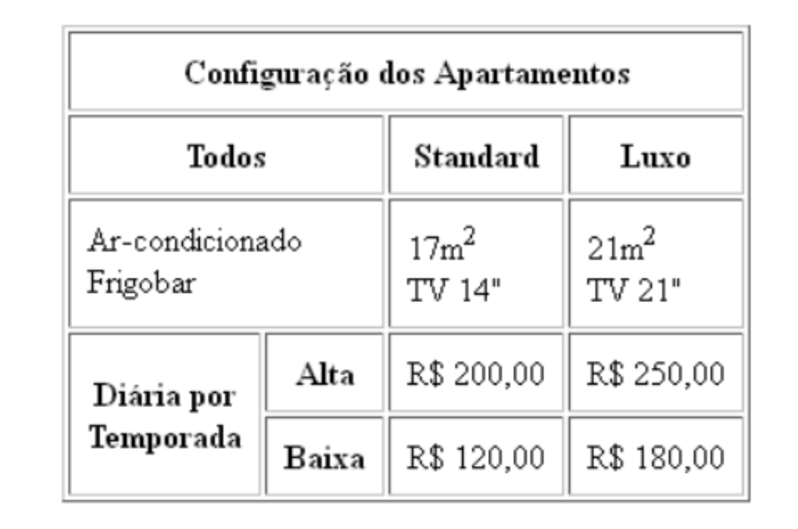
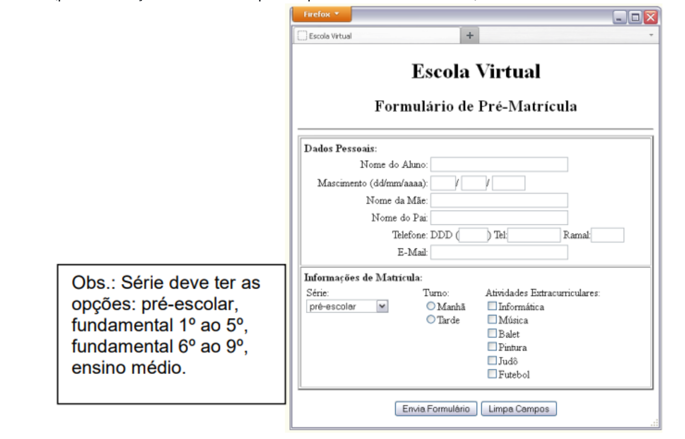

# Exercício Aplicações para Internet - Lista 1 - N2

> Prof. Edkallenn - Unipê. Ciência da Computação.

1. Crie uma nova página web para:

- Apresentar pelo menos 3 países com suas respectivas bandeiras, de cada um dos 5 continentes;

- O nome de cada país deve ser um link para a wikipedia (veja a figura, exemplo, Brasil);

- A bandeira de cada de cada país deve ser um link (veja a figura, exemplo, Brasil);

- Cada link deverá abrir a URL em uma nova página.

- Utilize os tipos de títulos e subtítulos conforme mostra a figura à esquerda, mas os textos podem ser personalizados por você;

- O nome da aba, aqui chamada "Bandeiras Nacionais", tamém pode ser personalizado.

2. Crie um documento HTML modificado a partir do exercício anterior (bandeiras) para mostrar cada bandeira numa célula diferente de uma tabela (organize a tabela como achar mais conveniente e apresentável.

3. Crie um novo documento HTML para apresentar a tabela que segue na figura abaixo (preste atenção nos detalhes da tabela para reproduzir com fidelidade):

4. Crie uma nova página da Web para apresentar o formulário mostrado na figura abaixo (preste atenção nos detalhes para reproduzir com fidelidade):

5. Crie uma página web para ser um menu com links onde cada um representará um dos 5 exercícios desenvolvidos anteriormente. Ao clicar em um link, apresente uma nova janela com o exercício correspondente. O exercício 5 (menu) será a base para a correção de toda lista de exercícios, portanto, certifique-se de que todos os links estarão funcionando corretamente. (Cuidado: o caminho deverá ser a página que você criou com os exercícios, com seu nome e número). Qualquer link "quebrado" será considerado exercício NÃO RESOLVIDO e será descontado da nota final, portanto, teste tudo antes da entrega! Insira uma referência ao número do exercício em cada página como por exemplo: Lista - Exercício 24.

> Envie somente o link do codepen ou replit do exercício 5.
